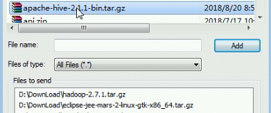
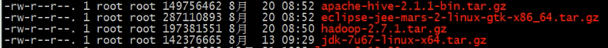
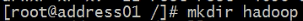
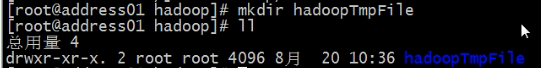
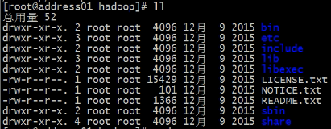
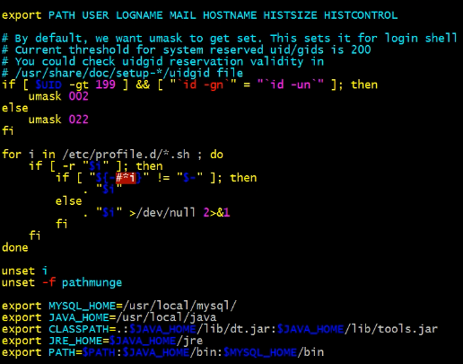
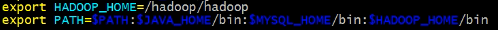
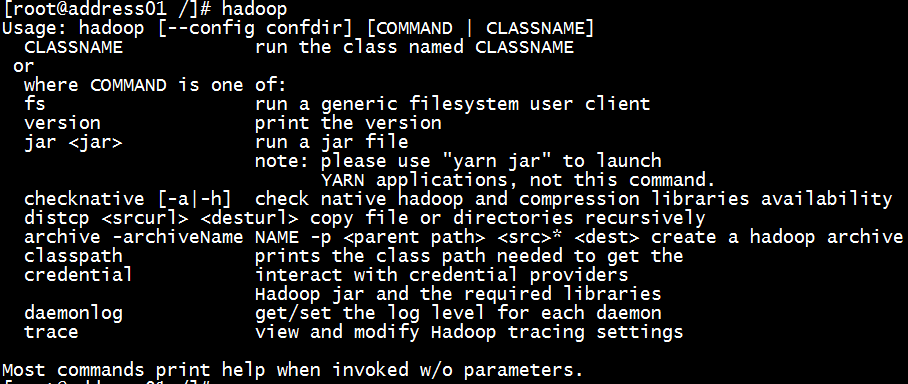

# BigData-Environment-Setup
配置Hadoop，Hive，Zookeeper，HBase方法总结
本机已经搭建Linux环境，安装secureCRT，Notepa++
## Hadoop搭建：

### 文件上传，解压：

* 打开虚拟机，打开终端。
* 在终端中输入命令 `rz` ，从本地上传配置文件（最好自己新建一个文件夹存放所有压缩包文件）。

* 选择 `hadoop-2.7.1.tar.gz`，`eclipse-jee-mars-2-linux-gtk-x86_64.tar.gz`，`apache-hive-2.1.1-bin.tar.gz` 上传（一般点击OK后会自动上传，如果没有则在输入一次命令 `rz` 就会启动上传）

* 等待上传完成，输入命令 `ll` 查看文件夹内所有文件：

* 确认上传成功后， `cd ..` 退回根目录

* 新建一个hadoop的文件夹用来存放文件 `mkdir hadoop`

* `cd hadoop` 进入Hadoop文件夹，新建一个hHadoopTemFile文件夹用来存放之后需要处理的csv文件， `mkdir hadoopTemFile` 。

* 返回存放压缩包的文件夹 `cd /software/` ,解压所有的压缩包文件,解压命令 `tar -zxf 文件名`。

* 将解压好的文件重命名 `mv hadoop-2.7.1 hadoop` ，并且移动到之前创建的hadoop文件夹中 `mv hadoop /hadoop/`。
* 在hadoop文件夹下查看所有文件，可以看到hadoop解压后的文件内容。

### 环境变量修改：

* 输入命令 `vim /etc/profile` 打开系统环境变量文件。

* 执行插入命令（键盘I键）。
* 在文件中添加hadoop的环境变量 `export HADOOP_HOME=/hadoop/hadoop ` （地址为你存放hadoop文件的地址）。
* 在 PATH 之后添加 `:$HADOOP_HOME/bin `。

* 按下esc，输入命令 `:wq` 后回车，保存并退出profile文件。
* 输入命令 `source /etc/profile ` 读取并执行更新后的profile文件。
* 输入命令 `hadoop` ，如果成功配置环境变量，就会输出相关信息如下图。

### Hadoop配置文件

* 在hadoop文件夹内新建tmp、hdfs/name、hdfs/data文件夹，命令为 `mkdir tmp`，`mkdir -p hdfs/name`，`mkdir -p hdfs/data`

* 修改新建文件夹的权限。`chmod -R 777 hdfs/` ，`chmod -R 777 tmp/`
* 在Notepad++中找到Hadoop的一些配置文件，hadoop-env.sh、yarn-env.sh、core-site.xml、hdfs-site.xml、mapred-site.xml、yarn-site.xml（这里如果没有安装Notepad++，可以直接在终端里修改，但是Notepad++中文件修改比较直观，推荐使用。）
* 修改hadoop-env.sh文件中的 `export JAVA_HOME=/usr/local/java`(修改为环境变量中JAVA_HOME的地址)
* 修改yarn-env.sh文件中的 `export JAVA_HOME=/usr/local/java`(修改为环境变量中JAVA_HOME的地址)
* 在文件core-site.xml文件中添加：
`
<configuration> 
  <property> 
    <name>fs.default.name</name> 
    <value>hdfs://192.168.2.101:9000</value>  ///和虚拟机的IP一致
    <description>HDFS的URI</description> 
  </property> 
  <property> 
    <name>hadoop.tmp.dir</name> 
    <value> /hadoop/hadoop/tmp </value>   ///之前新建的tmp文件夹地址
    <description>临时文件夹</description> 
  </property> 
</configuration>
`
（一定要注意缩进正确）
* 在hdfs-site.xml文件中添加
